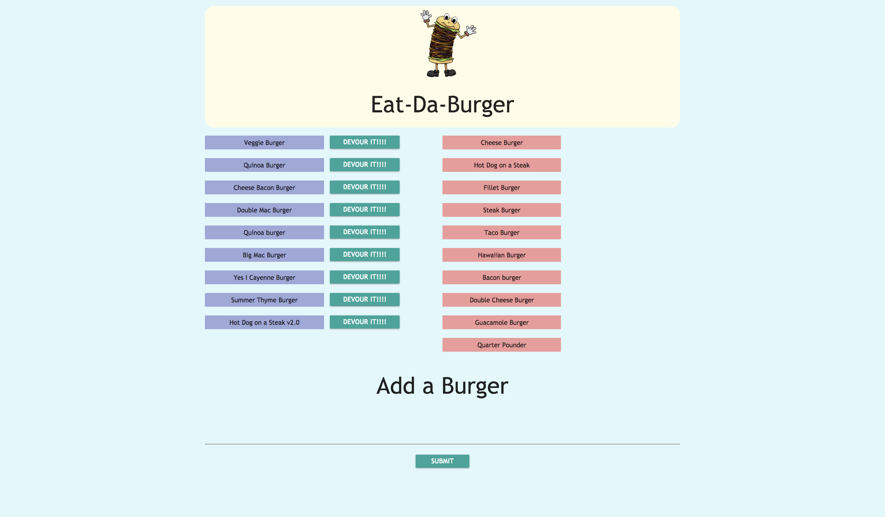

# Burger
The user can devour a burger if they like it so much or they can enter a new burger that they like and devour it

## Walk Through
The user can enter a new burger that they like and once they have typed in there favourite burger and click on submit the burger will get added to the left hand side of the page with a devour button in  (lavender color). If they click on the devour button the burger will get devoured and get displayed on the right hand side of the page with a different color(red)
## Dependencies
Node.Js: https://nodejs.org/en/
MySQL: https://www.mysql.com/
Express: https://expressjs.com/
Handlebars: https://www.npmjs.com/package/express-handlebars

## Link to the Deployed Site
https://eat-da-burger-sb.herokuapp.com/
## Framework used
Materialize: http://materializecss.com/getting-started.html

## Author
Sahana Balram

